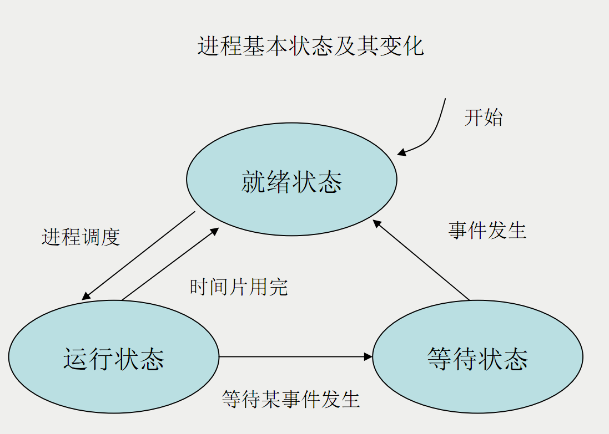
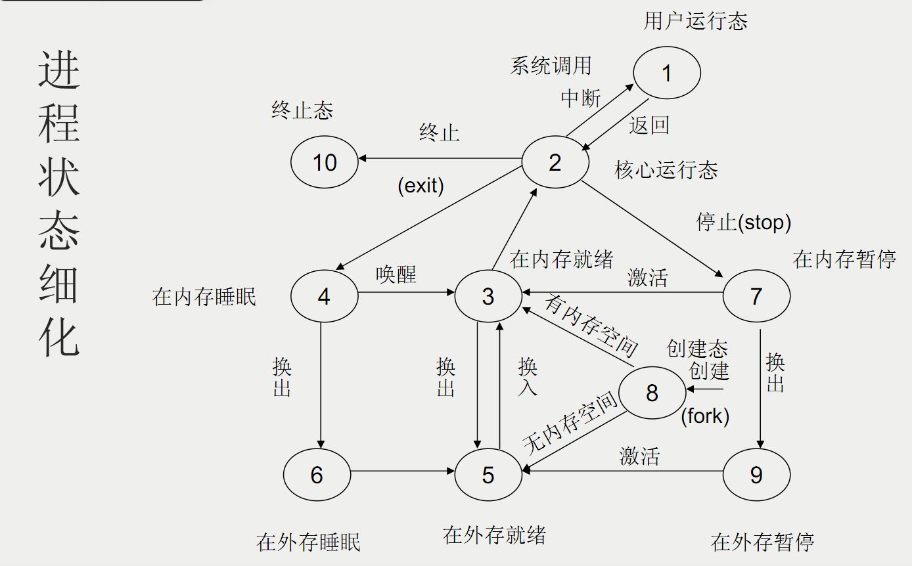

## 7.Linux进程管理

### 7.1 进程相关概念

#### 进程与程序的区别

1. 程序是静态的软件资源，进程是动态的，是程序的执行过程，有一定的生命周期

2. 程序和进程无一一对应的关系

* 父进程与子进程

1. 子进程是由一个进程所产生的进程，产生这个子进程的进程为子进程的父进程

2. 在Linux中，fork创建进程，fork复制的内容包括父进程的数据、堆栈段和父进程的进程环境

3. 父进程终止，子进程自然终止

#### 前台进程和后台进城

前台进程：在shell 输入命令后，创建一个子进程 运行命令，shell等待命令退出或者与之交互，用户在该命令完成前不能执行其他操作

后台进程：在 shell输入命令后带上 &，shell创建的子进程运行命令，不用等待命令退出，shell可进行其它操作，要求 该进程必须是**非交互式**的

#### 进程状态

* 进程的基本状态及其变化

|基本状态|含义|
|------|------|
|就绪|进程已分配到资源，但因其它进程占用CPU，暂时不能运行而等待分配CPU的状态|
|等待|因等待某种事件而暂时不能运行的状态|
|运行|进程分配到CPU，正在处理器上运行|

* 进程的详细状态及其变化

|细化状态|含义|
|------|------|
|用户态运行|在CPU上执行用户代码|
|核心态运行|在CPU上执行核心代码|
|在内存就绪|具备运行条件，只等调度程序为它分配CPU|
|在内存睡眠|因等待某一事件的发生，在内存中排队等待|
|在内存暂停|因调用stop程序后进入跟踪暂停状态，等待其父进程发送命令|
|在外存就绪|就绪进程被交换到外存上，继续等待|
|在外存睡眠|睡眠进程被交换到外存上继续等待|
|在外存暂停|处于跟踪暂停态的进程被交换到外存上|
|创建态|新进程正在被创建、但未完毕的中间状态|
|终止态|进程终止自己|

### 7.2 进程管理命令

#### 查看用户信息 w

w 显示所有用户的信息， w 用户名 显示指定用户的信息

load average 分别显示系统在过去1,5,15分钟内的平均负载程度

* **w**显示信息的含义

|列名|含义|
|------|------|
|JCPU|以终端代号来区分，该终端所有进程消耗CPU的时间|
|PCPU|CPU执行程序耗费的时间|
|WHAT|用户正在执行的操作|
|FROM|用户从何处登录系统 :0表示 该用户从XWindow下打开文本模式窗口登录|
|IDLE|用户闲置时间|

#### 查看系统中的进程 ps

ps 常用参数如下表：

|参数|含义|
|------|------|
|a|显示所有用户的进程|
|u|显示用户名和启动时间|
|x|显示没有控制终端的进程|
|e|显示所有进程，包括没有控制终端的进程|
|l|长格式显示|
|w|宽行显示，可用多个w加宽|

ps常用输出信息的含义如下表：

|列名|含义|
|------|------|
|TIME|进程自启动以来占用CPU的总时间|
|COMMAND/CMD|进程的命令名|
|USER|用户名|
|%CPU|占用CPU时间/总时间%|
|%MEM|占用内存/系统内存总量%|

ps 应用实例

> ps 查看隶属于自己的进程

> ps -u or -l 查看隶属于自己进程的详细信息

> ps -le or -aux 查看所有用户执行的进程的详细信息

> ps -aux --sort pid  可按进程执行的时间 PID UID等对进程进行排序

> ps -aux | grep username , ps -uU username 查看系统中指定用户转型的进程

> ps -le | grep init 查看指定进程信息

#### 杀死进程 kill

> kill 进程号 关闭进程

> kill -9 进程号 强行关闭

> kill -1 进程号  重启进程

> xkill 关闭图形程序

> killall 结束所有进程

> pgrep 服务名称 查看服务进程号

> pkill 进程名称 关闭进程

#### 指定进程的优先级 nice/renice

* nice n command 指定进程优先级 (-20<n<19)

> nice -5 myProgram

* renice n pid 

#### nohup

使进程在用户退出登录后仍旧执行，nohup命令将执行后的数据和信息默认存储到文件nohup.out中，nohup program &

#### 进程的挂起与恢复

进程的中止/挂起 Ctrl+Z

进程的终止 Ctrl+C

进程恢复到前台继续运行 fg

进程恢复到后台继续运行 bg

查看被挂起的进程 jobs

#### top  进程状态显示和进程控制

|参数|含义|
|------|------|
|d|指定刷新的时间间隔|
|c|显示整个命令行而不仅仅显示命令行|
|u|查看指定用户进程|
|k|终止执行中的进程|
|h or ?|获得帮助|
|r|重新设置进程优先级|
|r|重新设置进程优先级|
|s|改变刷新的时间间隔|
|W|将当前设置写入~/.toprc文件中|

### 7.3 计划任务

#### at

安排（一个或多个）作业在某一时刻执行一次

> at [-f 文件名] 时间

> at -d or atrm 删除队列中的任务

> at -l or atq 查看队列中的任务

1. 绝对计时方法

> midnight noon teatime

> hh:mm [today]

> hh:mm tomorrow

> hh:mm 星期几

> hh:mm MM/DD/YY

2. 相对计时方法

> now + n minutes

> now + n hours

> now + n days

3. 交互方式

> at 9:00

> at -f at.script 9:00  or at < at.script 9:00

4. at配置文件

限制哪些用户可以使用at命令，/etc/at.allow,/etc/at.deny

at.allow存在，其中的用户能执行at

at.deny存在，不在其中的用户能执行at

两者皆不存在，只有root能执行at

两者都存在，且为空，所有用户都能执行at

#### batch

安排（一个或多个）作业在系统负载不重时(一般是指平均负载降到0.8)执行一次

用法同 at

#### cron

安排周期性运行的作业

用于生成 cron进程所需的crontab文件

> crontab -l 显示当前的crontab

> crontab -r 删除当前的crontab

> crontab -e 编辑当前的crontab

crontab文件格式如下

minute hour day-of-month month-of-year day-of-week commands

其中具体释义如下：

|项|含义|
|------|------|
|minute|一小时中的哪一分钟[0-59]|
|hour|一天中的哪个小时[0-23]|
|day-of-month|一月中的哪一天[1-31]|
|month-of-year|一年中的哪一月[1-12]|
|day-of-week|一周中的哪一天[0-6]|
|commands|执行的命令|

填写注意事项

* 选项不能为空，不知道咋填 填 **\***

* 每个时间段可以指定多个值，不连续的用 , ，连续的用 - 

* 命令应该给出 绝对路径

* 用户 应具有运行对应命令的权限

crontab文件建立好之后，可以在/var/spool/cron目录确认

crontab命令的限制用户使用 可以利用 /etc/cron.allow /etc/cron.deny来指定

### 7.4 进程处理方式

#### standalone 独立运行

#### xinetd 进程托管

#### atd crond 计划任务